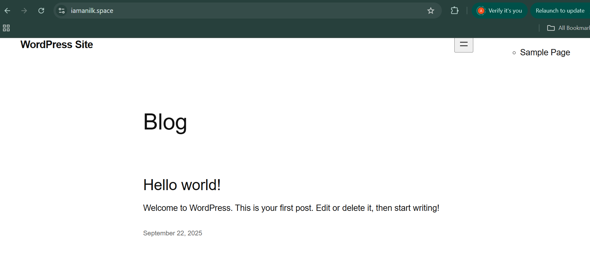

# Scenario 1 — WordPress on AWS (Quickstart)

**🌐 You can browse the website at https://www.iamanilk.space**

**Note: Due to domain cost considerations, a single domain was used for testing all scenarios. Currently, all three scenarios are offline, but each can be fully deployed using the provided Terraform scripts.**

Provision a minimal, production‑like WordPress stack on AWS with Terraform: VPC, ALB, Auto Scaling EC2 web tier, EFS for wp‑content, and RDS MySQL. DNS/TLS is www‑only.

## What it creates

- VPC (2 public subnets for ALB/EC2, 2 private subnets for RDS/EFS)
- Security groups between ALB ↔ EC2 ↔ RDS/EFS
- ALB with:
	- HTTP: redirect to HTTPS for host www.<domain>
	- HTTPS: forward only for host www.<domain>; default 403
- ASG + Launch Template (Amazon Linux 2) installing WordPress via `userdata.tpl`
- RDS MySQL (password stored in Secrets Manager)
- EFS mounted at `/var/www/html/wp-content`
- Optional Route53 hosted zone, ACM cert, and `www` A record

## Minimal inputs

- `region` (default `ap-south-1`)
- `project_name` (default `wp-ha`)
- `domain_name` (optional; enables www DNS/TLS)
- `hosted_zone_id` (optional; use existing zone)
- `instance_type` (default `t3.micro`)
- `desired_capacity`/`min_size`/`max_size` (defaults 2/2/6)

## Deploy (Windows cmd.exe)

Run in `scenario1`:

```bat
terraform init
terraform plan -out plan.out
terraform apply plan.out
```

Example `terraform.tfvars`:

```hcl
region          = "ap-south-1"
project_name    = "wp-ha"
domain_name     = "example.com"   # optional
hosted_zone_id  = "Z123456789ABC" # optional
instance_type   = "t3.micro"
desired_capacity = 2
min_size         = 2
max_size         = 6
```

Outputs to note:

- `alb_dns_name` — Direct ALB DNS returns 403; use `https://www.<domain>`
- `db_endpoint` — RDS endpoint
- `db_password_secret_arn` — DB creds secret

## Scaling (RequestCount)

- ≥30 req/min: capacity 2
- ≥50 req/min: capacity 4
- ≥100 req/min: capacity 6
- <10 req/min for 2 min: scale to 2

## Snapshot of the hosted WordPress site

Here’s a placeholder for the site snapshot. Save your screenshot as `images/wordpress-snapshot.png` and it will render below:



## Troubleshooting

- 403 on ALB DNS: expected (www‑only rules)
- Targets unhealthy: check `/health.html`, SGs, and user data
- DNS/TLS pending: wait for Route53/ACM validation

Notes: Launch template uses name_prefix to avoid collisions. Adjust modules and `userdata.tpl` for production (backups, WAF, logging).
